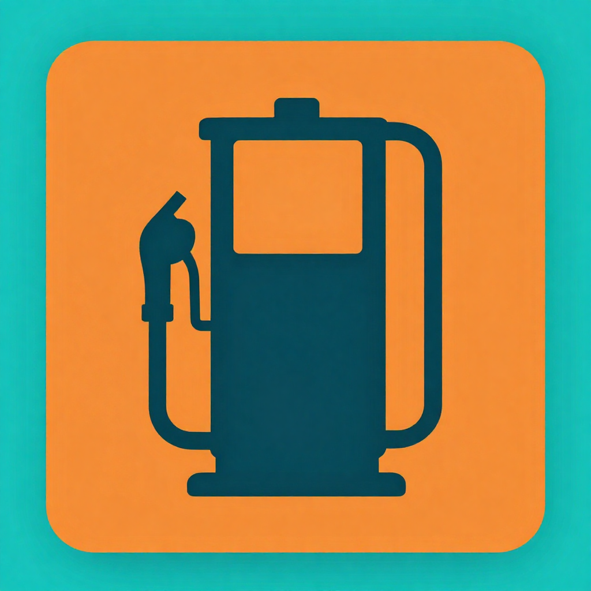
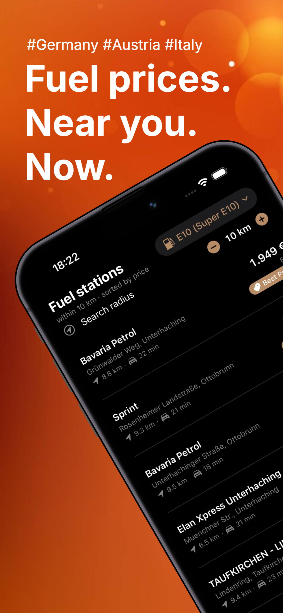
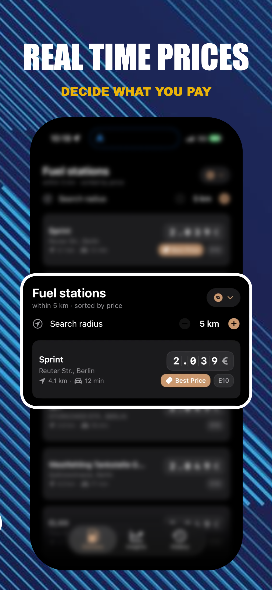
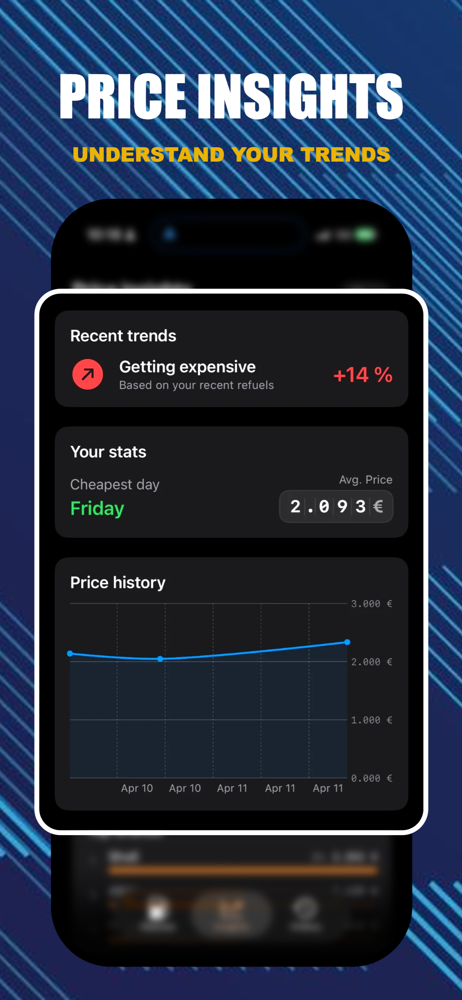
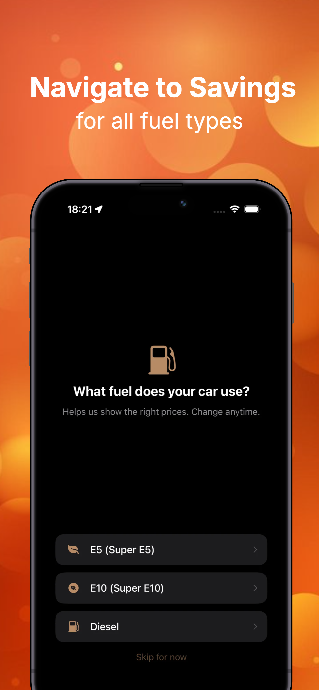

#  Tank Radar 
Real-time fuel prices with CarPlay support in Germany, Austria and Italy. Find the cheapest station near you and navigate hands-free.

  
  &nbsp;&nbsp;
  
  &nbsp;&nbsp;
  
  &nbsp;&nbsp;
  

## 

Tank Radar shows you real-time fuel prices at stations near you in Germany, Austria and Italy - with full CarPlay support so you can find the best deal right from your car’s display.

## CarPlay integration
View nearby stations and prices directly on your CarPlay screen. Access price insights, review your refueling history, and tap to get turn-by-turn directions to the cheapest station; hands-free and distraction-free while driving.

## Price insights and refueling history
Track your fuel spending with our new Refueling History tab, complete with the ability to edit past record prices. Make informed decisions using the new Price Insights view, featuring revamped station lists and detailed views available on both your iPhone and CarPlay.

## Find cheaper fuel nearby
Set your search radius between 5 and 25 km and instantly see stations around you, sorted by price and distance. The best price for your fuel type is clearly highlighted at the top of the list.

## Supports local fuel types
Tank Radar automatically adapts to the country you are in and shows the fuel types that are actually available there:  
- **Germany**: E5, E10, Diesel  
- **Austria**: E5, Diesel, CNG  
- **Italy**: E5, Diesel, LPG, CNG  

If a fuel type is not sold in the country you are currently driving in, Tank Radar clearly warns you and shows prices for the closest matching fuel type instead.

## Smart for rental cars and road trips
Drive different cars often? You can quickly reset your preferred fuel type from the main screen so the app always matches the car you are in.  
On road trips across borders, Tank Radar updates fuel types and prices automatically as you move into a new country.

## On-device ETA and live updates
Estimated travel time (ETA) to each station is calculated directly on your device, so you can see how long it will take to get there.  
Pull to refresh anytime for the latest prices.

## Navigate with your faviouriite Maps app
Found a good price? Tap any station to open the route in your preferred navigation app, including Google Maps and Waze, and start driving right away —
or use CarPlay directly.

## Supported Languages
Tank Radar is available in:  
- English  
- German  
- Italian  
